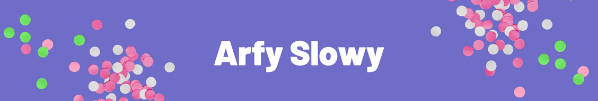

  
 

<!-- 
  
 -->

- 💬 Ask me about **System engineering, Artificial Intelligence, and quantum computing**

- ⚡ Fun fact **i'm don't know about web developer**

<h3 align="left">Connect with me:</h3>

## Statistic

## current project
| Project name  | Description |   status        |
| ------------- | ------------- | ------------- |
| [Literate](https://github.com/literateOS/literate)  | Open source operating system  |  |

# Language and tools

## talk to me

